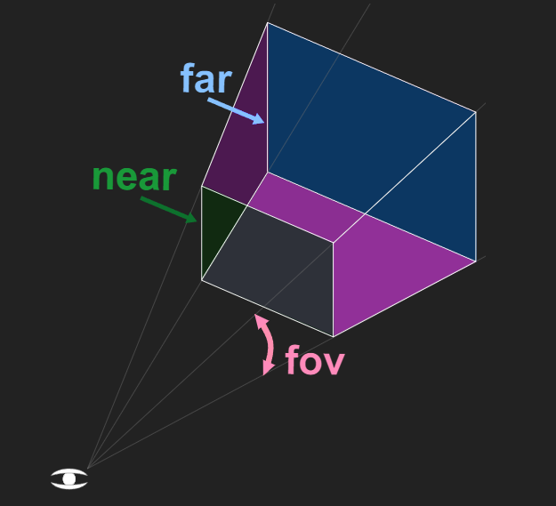

## WebGL

- 웹 브라우저에서 3D 그래픽을 렌더링 하기 위해 지원하는 JS API
- 점, 선, 삼각형 등의 단순한 3D 그래픽을 그릴 수 있다.

<br />

## Three


- 웹에서 3D 객체를 쉽게 렌더링할 수 있도록 도와주는 JS 라이브러리
- Three 로 무언가를 만드려면 Scene, camera, renderer가 있어야 함.
- 위 세가지가 기본 구조고 Mesh

<br />

## Scene

```js
const scene = new THREE.Scene();
```

- Scene 그래프의 최상위 노드로서 배경색/안개등의 요소를 포함
- Scene 그래프는 다수의 Mesh, Light, Group. Object3D, Camera 로 이루어짐

<br />

## Renderer

```js
const renderer = new THREE.WebGLRenderer();
renderer.setSize(window.innerWidth, window.innerHeight); // 렌더러 사이즈 설정
```

- Scene과 camera를 넘겨받아 3D씬의 일부를 2차원 화면에 그려주는 역할
- 주로 `WebGLRenderer` 사용

<br />

## Camera

```js
const fov = 75;
const aspect = 2;
const near = 0.5;
const far = 5;
const camera = new THREE.PerspectiveCamera(fov, aspect, near, far);
```

- scene을 관찰하는 시점을 정의
- 여러 종류의 카메라가 있지만 주로 `PerspectiveCamera`와 `OrthographicCamera`가 사용된다.
- PerspectiveCamera
  - 가장 대표적인 카메라 아래 4가지 값을 받는다.
  - field of view(FOV) : 시야각. 해당 시점이 화면에 보여지는 정도. 대부분이 radians 단위지만 얘만 degree단위
  - aspect ratio : 가로세로비율
  - near : near 절단면. 해당 값보다 가까이 있으면 렌더링 되지 않음
  - far : far 절단면. 해당 값보다 멀리 있으면 렌더링 되지 않음
  - 위의 네가지 속성으로 피라미드처럼 생긴 정육면체를 만들 수잇는데 이부분만 볼 수 있다.
    

<br />

## Mesh

```js
// 지오메트리랑 메트리얼로 메시를 만듬
const cube = new THREE.Mesh(geometry, material);
```

- 3D 객체
- Geometry와 Material로 구성되어 있다.

<br/>

## Geometry

```js
const boxWidth = 1;
const boxHeight = 1;
const boxDepth = 1;
const geometry = new THREE.BoxGeometry(boxWidth, boxHeight, boxDepth);
```

- 객체의 형태
- 기본적으로 제공되는 형태가 있으며 직접 만들 수 있다.

<br/>

## Material

```js
const material = new THREE.MeshPhongMaterial({ color: 0x00ff00 });
```

- 객체의 재질, 색, 밝기

<br/>

## Light

```js
const light = new THREE.DirectionalLight(color, intensity);
```

- 광원

<br/>

## Texture

- 파일에서 로드한 이미지나 캔버스로 생성한 이미지 또는 다른씬으로 렌더링한 결과물
